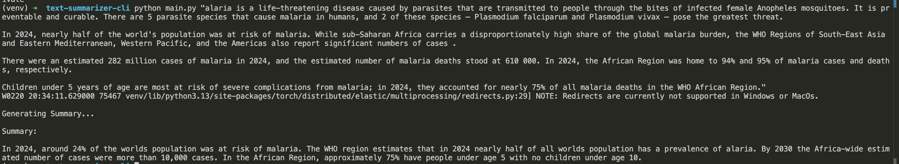

# 🧠 Text Summarizer CLI

<p align="center">
  
  
  
  
  
  
  
</p>

A lightweight, transformer-powered Command-Line Text Summarizer built using Hugging Face Transformers and Google's FLAN-T5 model.

This project demonstrates practical implementation of:

- Transformer-based NLP systems  
- Prompt engineering  
- Beam search decoding  
- Repetition control mechanisms  
- CLI-based ML application design  
- Efficient local model inference  

---

# 🚀 Installation, Setup, Requirements, Usage, Model Configuration, Example, Output, Project Structure & Author

---

## 🔧 Clone the Repository (Mac / Linux / Windows)

```bash
git clone https://github.com/ronitmaheshwari05/text-summarizer-cli.git
cd text-summarizer-cli
```

---

## 🖥️ Virtual Environment Setup

### 🍎 Mac / Linux

```bash
python3 -m venv venv
source venv/bin/activate
pip install -r requirements.txt
```

---

### 🪟 Windows (PowerShell)

```powershell
python -m venv venv
venv\Scripts\activate
pip install -r requirements.txt
```

---

## 📦 Requirements

```
transformers>=4.37.0
torch>=2.6.0
accelerate>=0.27.0
```

---

## ▶️ Usage

Run the CLI tool:

```bash
python main.py "Paste your long article text here..."
```

The system will:

- Accept long-form text input  
- Perform abstractive summarization using FLAN-T5  
- Apply beam search for stable decoding  
- Control repetition using n-gram blocking  
- Output a clean structured summary in the terminal  

---

## 🤖 Model Configuration

- Model: `google/flan-t5-small`
- Pipeline: `text2text-generation`
- Beam Search: `num_beams=5`
- Repetition Penalty: `1.6`
- No Repeat N-gram Size: `3`
- Deterministic Mode: `do_sample=False`
- Early Stopping Enabled
- Output Length Control via `max_new_tokens`

These configurations ensure:

- Stable generation  
- Reduced redundancy  
- Improved coherence  
- Balanced compression  

---

## 🧪 Example

### 📥 Input

```
Urban vertical farming is emerging as a transformative approach to food production in densely populated cities. As urban populations continue to grow, traditional agricultural systems face increasing pressure due to limited arable land, water scarcity, and supply chain disruptions. Vertical farming addresses these challenges by cultivating crops in stacked layers within controlled indoor environments. By leveraging hydroponics, aeroponics, and LED lighting systems, vertical farms can produce food year-round regardless of external weather conditions.

One of the most significant advantages of vertical farming is its efficient resource utilization. Compared to traditional farming, hydroponic systems can reduce water usage by up to 90% because water is recycled within the system. Additionally, since crops are grown indoors, there is minimal need for pesticides, reducing chemical exposure and environmental contamination. The ability to control temperature, humidity, and nutrient levels also allows farmers to optimize plant growth cycles and achieve consistent yields.

Technological integration plays a central role in the success of vertical farming operations. Sensors monitor environmental parameters such as light intensity, pH levels, and nutrient concentrations in real time. Data analytics platforms process this information to automate irrigation schedules and lighting adjustments. Some advanced facilities incorporate artificial intelligence to predict crop performance and detect early signs of plant stress or disease. This data-driven model enhances productivity while minimizing waste.

Despite its advantages, vertical farming faces economic and scalability challenges. Initial setup costs are high due to infrastructure requirements, energy consumption, and specialized equipment. Electricity remains a major expense, particularly for artificial lighting systems. Critics argue that the energy footprint of vertical farms could offset their environmental benefits unless renewable energy sources are integrated into operations.

Looking ahead, advancements in energy-efficient LEDs, renewable power integration, and automation technologies are expected to reduce operational costs. Governments and private investors are increasingly supporting urban agriculture initiatives as part of sustainability strategies. If technological and economic barriers continue to decrease, vertical farming may become a cornerstone of resilient urban food systems in the coming decades.
```

### 📤 Output

```
Urban vertical farming is emerging as a transformative approach to food production in densely populated cities. As urban populations continue to grow, traditional agricultural systems face increasing pressure due to limited arable land, water scarcity, and supply chain disruptions. Vertical farming addresses these challenges by cultivating crops in stacked layers within controlled indoor environments. By leveraging hydroponics, aeroponics
```

---

## 📁 Project Structure

```
text-summarizer-cli/
│
├── main.py
├── summarizer.py
├── requirements.txt
├── README.md
├── Demo.png
└── venv/ (excluded from GitHub)
```

---

## 📸 Demo



---

## 🚀 Upcoming Features

- 💾 Save generated summaries  
- 📂 View saved summaries  
- 📊 Word count display  
- ⏱ Execution time measurement  
- 🎯 Adjustable summary length modes  
- 📄 File-based input support  
- 📈 Evaluation metrics (ROUGE scoring)  

---

## 🤝 Contributions

Contributions, feature suggestions, and improvements are welcome.

If you would like to improve this project:

1. Fork the repository  
2. Create a new branch  
3. Implement your improvements  
4. Submit a Pull Request  

If you suggest meaningful updates or optimizations, feel free to open a PR.

---

## 👨‍💻 Author

Ronit Maheshwari  
B.Tech Computer Science (AI & ML)  
Machine Learning & MLOps Enthusiast  

---

⭐ If you found this project useful, consider giving it a star!
